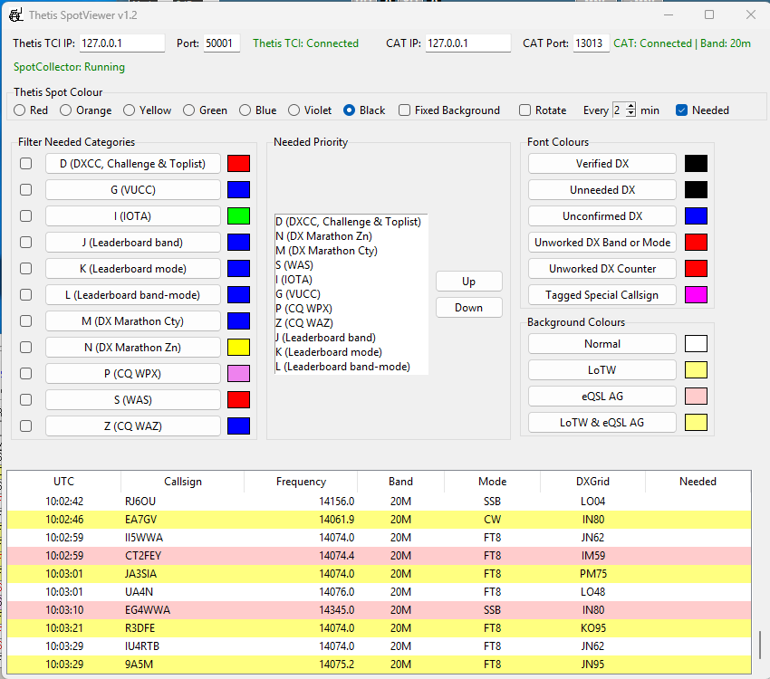

# Spotviewer
DXLab Spotcollector to Thetis bridge
## Screenshot

# SpotViewer for DXLab SpotCollector + Thetis

SpotViewer is a lightweight Windows application that reads DX cluster spots from **DXLab SpotCollector** and forwards selected spots to **Thetis SDR** using its WebSocket interface.

It allows real-time visualisation of DX spots inside Thetis, with filtering by band, mode, and priority, plus configurable colour handling.

---

## Features

- Reads live DX spots directly from **DXLab SpotCollector**
- Automatically detects the SpotCollector database path from the Windows registry
- Sends spots to **Thetis** via WebSocket (TCI)
- Automatic band selection using Thetis TCI IP
- Optional priority filtering
- Configurable spot colours
- Automatic reconnect if SpotCollector or Thetis restarts
- Persistent configuration saved between runs
- Windows standalone executable

---

## Requirements

- **Windows 10 or Windows 11**
- **DXLab SpotCollector** (running)
- **Thetis SDR** (running, WebSocket enabled)
- Network access to Thetis (usually `127.0.0.1`)

---

## Installation

1. Download the latest release from the **Releases** page
2. Run `SpotViewer_<version>.exe`
3. No installation required

---

## Configuration

On first run, SpotViewer will:

- Attempt to locate the SpotCollector database automatically
- Create a configuration file:

Settings are saved automatically when changed, including:
- Thetis host and port
- Enabled bands
- Enabled modes
- Priority filtering
- Colour selection behaviour

Once connected, network settings are locked to prevent accidental changes.

---

## Usage

1. Start **DXLab SpotCollector**
2. Start **Thetis**
3. Launch **SpotViewer**
4. Confirm connection status indicators
5. Select desired colours
6. Spots will appear in Thetis in real time

If either SpotCollector or Thetis is restarted, SpotViewer will automatically reconnect.

---

## Band and mode filtering

- Band selection is automatic based on Thetis TCI connection.
- With nothing selected in Filter needed categories, all spots for the band will be passed to Thetis.
- If Fixed Colour is selected the colour selected will be used for the background for all spots. 
- If rotate is selected the colours will rotate through the spectrum based on the time selected in the spinner, This aids recognition of the latest spots.
- If Needed is selected the background of all spots will be black and the needed stations will be coloured as selected in the Filter needed categories.
- If Filter Categories are checked then only these categories will be passed to Thetis (there will be no unwanted spots).
- Where a station is needed in more than one category the colour of the highest priority station defined in the Needed priority section will be used.
- Awards can be further filtered by Mode if desired.
- Filter changes take effect immediately without restarting the application, spots in Thetis are cleared based upon the "Show TCI Spots" in the TCI Server section of Thetis Setup.

---

## Configuration persistence

All user settings are automatically saved

This includes:
- Thetis host and port
- Mode selections
- Priority filter state
- Colour selection options

Settings are restored on the next launch.

## Shutdown behaviour

SpotViewer can be closed at any time:

- Database connections are closed cleanly
- WebSocket connections are closed gracefully
- No changes are made to the SpotCollector database

## Notes & Limitations

- SpotViewer is receive-only; it does not modify the SpotCollector database
- Only spots newer than the last processed index are forwarded
- Designed for a single SpotCollector instance
- Windows only

---

## Versioning

Releases follow semantic versioning:

- `v1.1` – Initial public release
- Minor releases add features or improvements
- Patch releases fix bugs only

---

## License

This project is provided as-is for amateur radio use.  
No warranty is expressed or implied.

---

## Acknowledgements

- DXLab Suite – SpotCollector
- Thetis SDR
- Amateur radio community for testing and feedback

